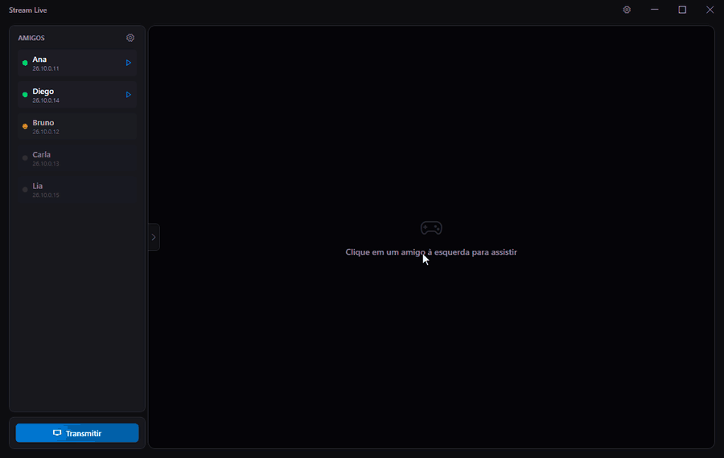
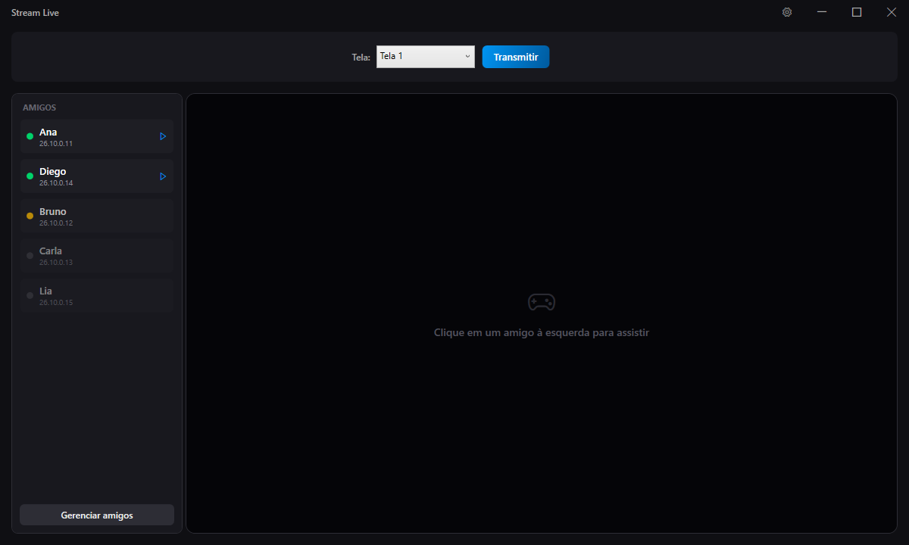
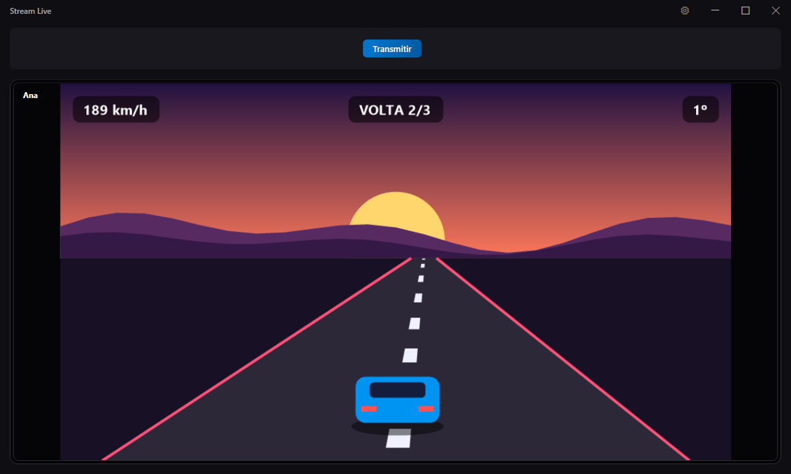
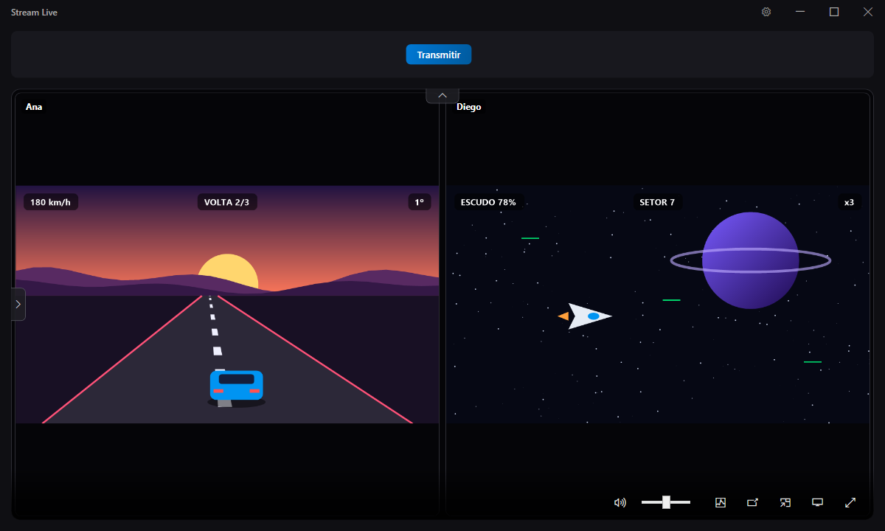
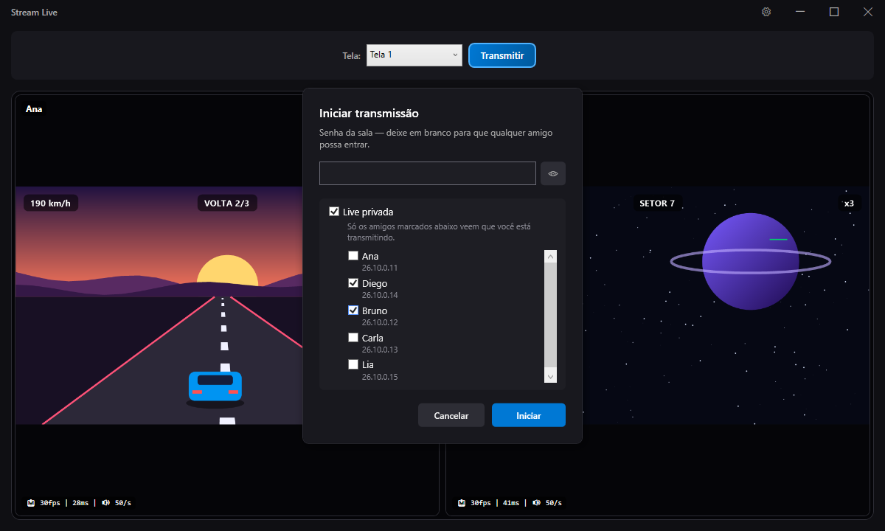
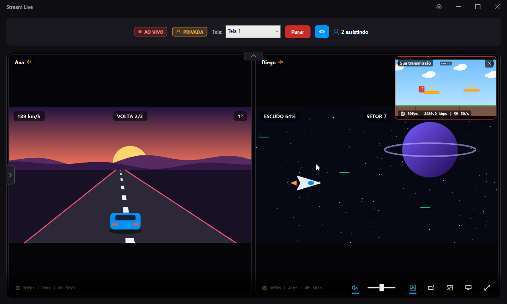

# 🎥 Stream Live


<p align="center">
  
</p>

<p align="center"><sub>Amigos e lives fictícios, gravados com o modo demonstração (<code>--demo</code>). As cenas são desenhadas pelo próprio app no lugar das telas de verdade. Todas as telas estão em <a href="#-telas">Telas</a>.</sub></p>

**Stream Live** é um aplicativo desktop desenvolvido em C# com WPF (.NET 8.0) focado na captura e transmissão de áudio e vídeo em tempo real. Ele foi projetado para facilitar sessões de streaming privadas com **amigos** via [Radmin VPN](https://www.radmin-vpn.com/), oferecendo opções avançadas de captura de tela e áudio (global ou por processo) usando WebSockets e WebRTC.

> ⚠️ **Aviso de Segurança Importante!**
> Este aplicativo foi feito **exclusivamente para ser usado entre amigos de confiança**.
> **Não o utilize com estranhos ou pessoas não confiáveis.** O projeto não foi auditado profissionalmente.
>
> O que existe hoje de proteção:
> * **Lista de permissão por IP** (ligada por padrão): só quem está na sua lista de amigos consegue abrir conexão. Pode ser desligada em *Configurações*.
> * **Senha de sala opcional** com autenticação por desafio-resposta — a senha nunca trafega na rede; o viewer devolve um HMAC do desafio.
> * **Criptografia AES-GCM** do conteúdo da sala **quando ela tem senha**, com chave derivada por PBKDF2 (200k iterações). **Sem senha, áudio e sinalização trafegam sem criptografia** (PCM cru sobre `ws://`).
>
> O que **não** existe: TLS no canal de sinalização, certificados, ou qualquer defesa contra alguém que já tenha acesso privilegiado à sua rede virtual.
>
> **Use uma senha longa.** Quem conseguir observar o tráfego da VPN vê o desafio e a resposta do login e pode testar senhas offline; uma senha curta cai rápido. Veja também [Riscos conhecidos](#-riscos-conhecidos).

---

## 📖 História do Usuário (Objetivo)

O projeto nasceu da seguinte necessidade:
*Um app instalável para hostear transmissões ou participar (Join) de lives com amigos via Radmin VPN.*

* **Para quem transmite (Host):**
  * Escolher qual monitor transmitir (suporte a múltiplas telas).
  * O áudio do Discord fica sempre fora da captura, para evitar retorno nas chamadas de voz.
    Com o Discord fechado, o áudio do sistema inteiro é transmitido normalmente.
  * Senha de sala opcional, pedida ao iniciar a transmissão.
  * **Live privada:** marque quais amigos podem ver a transmissão. Para todos os outros você
    aparece como offline, e nem a existência da live é anunciada — diferente da senha, que
    barra a entrada mas deixa todo mundo ver que você está transmitindo.
  * O Host não ouve a própria transmissão.
* **Para quem assiste (Join):**
  * Receber áudio e vídeo em alta qualidade (1080p).
  * Modo teatro (somente a live) e Tela Cheia (Fullscreen).
  * Controle de volume local.

---

## 📸 Telas

| | |
|---|---|
|  |  |
| **Lista de amigos.** Verde: em live (clique para assistir). Amarelo: online sem transmitir. Cinza: offline. | **Uma live aberta.** A lista recolhe para o vídeo ocupar a janela; volume, estatísticas, PiP, teatro e tela cheia ficam na barra de baixo. |
|  |  |
| **Várias lives em grade.** Cada uma com seu volume; um clique foca só nela sem desconectar as outras. | **Iniciar transmissão.** Senha opcional e live privada, escolhendo quais amigos podem ver. |
|  | |
| **Transmitindo.** Selos de *ao vivo* e *privada*, quem está assistindo e o preview da sua transmissão. As lives abertas ficam mudas para o som delas não voltar pela captura. | |

---

## 🛠️ Pré-requisitos

Para compilar e gerar o instalador do projeto, você precisará das seguintes ferramentas:

1. **.NET SDK 8.0**: Necessário para construir a aplicação. Os comandos abaixo usam um SDK
   local em `.dotnet` (fora do versionamento). Num clone novo essa pasta não existe: instale o
   SDK normalmente (`winget install Microsoft.DotNet.SDK.8`) e troque `.\.dotnet\dotnet.exe`
   por `dotnet`, ou recrie a pasta com o
   [script oficial da Microsoft](https://dot.net/v1/dotnet-install.ps1):
   `.\dotnet-install.ps1 -Channel 8.0 -InstallDir .dotnet`
   O `global.json` fixa a linha 8.0: um SDK mais novo instalado na máquina não é usado por engano.
2. **Inno Setup 6**: Necessário para gerar o arquivo `.exe` de instalação (`setup.exe`).
   - Pode ser instalado via WinGet: `winget install JRSoftware.InnoSetup`
   - Ou baixado diretamente em: [jrsoftware.org](https://jrsoftware.org/isdl.php)

---

## 🚀 Como Compilar o Projeto

O processo de compilação foi automatizado para rodar em uma única linha de comando via PowerShell. O comando limpa os diretórios de builds anteriores, publica o executável em modo *self-contained* e já aciona o Inno Setup para gerar o instalador final.

Abra o terminal **PowerShell** na pasta raiz do projeto e execute:

```powershell
if (Test-Path "publish_zip") { Remove-Item -Recurse -Force "publish_zip" } ; & ".\.dotnet\dotnet.exe" publish src\StreamLiveApp\StreamLiveApp.csproj -c Release -r win-x64 --self-contained true -o "publish_zip" ; & "$env:LOCALAPPDATA\Programs\Inno Setup 6\ISCC.exe" build\setup.iss
```

> 💡 **Dica:** Caso o `ISCC.exe` não seja encontrado no diretório local durante a compilação, verifique se o Inno Setup foi instalado globalmente em `C:\Program Files (x86)\Inno Setup 6\ISCC.exe` e ajuste o caminho no comando acima.

O instalador final será gerado na raiz do projeto com o nome **`StreamLive_Setup.exe`**.

---

## 📁 Estrutura do Projeto

```
.
├── StreamLive.sln                # Solução (um projeto hoje; ponto de entrada do build)
├── global.json                   # Fixa o SDK na linha 8.0
├── docs/images/                  # Vídeo e prints do README (gravados com --demo)
├── build/
│   ├── setup.iss                 # Script do Inno Setup; caminhos relativos a esta pasta
│   └── version.iss               # Gerado pelo build a partir de <Version> — não editar
├── .github/workflows/ci.yml      # CI: restore + build + testes em windows-latest
├── src/
│   └── StreamLiveApp/
│       ├── StreamLiveApp.csproj
│       ├── App.xaml(.cs)         # Entrada do WPF e captura global de exceções
│       ├── Assets/               # app_icon.ico
│       ├── Core/                 # StreamManager, HostBroadcast, ViewerSession, cripto, updates
│       ├── Helpers/              # Enumeração de monitores (Win32)
│       ├── Media/                # Captura de tela (DXGI/GDI) e de áudio (WASAPI/por processo)
│       ├── Models/               # Friend
│       ├── Network/              # SignalingServer / SignalingClient / SignalingMessage
│       ├── Services/             # Persistência (amigos, settings) e status dos amigos
│       ├── Views/                # MainWindow, PipWindow, StreamTab e os diálogos
│       ├── FFmpegLibs/           # DLLs do FFmpeg (Git LFS)
│       └── NativeLibs/           # ApplicationLoopback.dll (captura de áudio por processo)
├── tests/
│   └── StreamLiveApp.Tests/      # xUnit: cripto, handshake de sala (servidor real), captura, rede
└── publish_zip/                  # Saída do publish, consumida pelo instalador (gerada)
```

O instalador final sai na raiz como **`StreamLive_Setup.exe`**.

**Modo demonstração:** amigos fictícios, lives com cenas desenhadas pelo próprio app, sem rede
(o servidor da porta 8080 não sobe) e sem gravar `friends.json` nem `settings.json`. É o modo
usado no vídeo e nos prints acima:

```powershell
.\.dotnet\dotnet.exe run --project src\StreamLiveApp -c Release -- --demo
```

**Testes:** a suíte xUnit em `tests/` roda no CI a cada push. Localmente:

```powershell
.\.dotnet\dotnet.exe test StreamLive.sln -c Release
```

**Bibliotecas importantes**

| Biblioteca | Papel |
|---|---|
| `Fleck` | Servidor WebSocket (sinalização, lado host) |
| `Websocket.Client` | Cliente WebSocket (lado viewer) |
| `NAudio` | Captura e reprodução de áudio |
| `SIPSorcery` + `SIPSorceryMedia.FFmpeg` | WebRTC e codec H.264 |
| `Vortice.Direct3D11` / `Vortice.DXGI` | Captura de tela via Desktop Duplication |
| `ApplicationLoopback.dll` | Captura de áudio por processo (DLL nativa, P/Invoke) |

---

## 🎛️ Como a mídia trafega

| Mídia | Codec | Transporte |
|---|---|---|
| Vídeo | H.264 (libx264, `ultrafast` + `zerolatency`) | Trilha de vídeo do WebRTC |
| Áudio | PCM 44,1 kHz estéreo, 16 bits (sem compressão) | WebSocket de sinalização |
| Sinalização | JSON | WebSocket na porta 8080 |

A captura de tela usa a **Desktop Duplication API (DXGI)**, com o `CopyFromScreen` do GDI como
reserva automática para máquinas onde a duplicação não está disponível (RDP, drivers antigos).

> O áudio já viajou em Opus pela trilha do WebRTC (v1.0.18 a v1.0.21), o que gastaria bem menos
> banda e manteria som e imagem em sincronia. Nunca funcionou em campo e foi revertido. O PCM
> cru custa ~1,4 Mbps por viewer e não sincroniza com o vídeo, mas funciona — e o atraso que
> se acumula por diferença de relógio é contido pelo `LatencyTrimmingProvider`.

---

## ⚖️ Limitações conhecidas

- **`SIPSorcery` 8.0.23 tem advisories abertos** (`GHSA-28gm-jrmw-xx93`, `GHSA-jwjp-4649-v8jp`).
  A correção só existe na linha 10.x, que exige **.NET 10** — migrar o projeto inteiro é o
  pré-requisito para fechar esse ponto.
- O canal de sinalização é `ws://` puro, sem TLS.
- `Fleck` 1.2.0 (servidor WebSocket) não recebe atualizações há anos.

---

## 🔐 Riscos conhecidos

Pontos que valem para quem for usar ou adaptar o projeto:

- **Senha fraca pode ser quebrada offline.** O desafio e o HMAC do login passam pela VPN, e o
  salt do PBKDF2 é fixo no app. Com senha longa isso fica impraticável. Salt por sala e chaves
  separadas para o HMAC e para o AES seriam a próxima evolução.
- **O servidor escuta em todas as interfaces (`0.0.0.0:8080`).** A lista de amigos por IP vem
  ligada e é o que protege a porta. Com ela desligada, entra qualquer máquina da Radmin
  (`26.0.0.0/8`) — a rede local e quem alcançar a porta pelo roteador continuam recusados —,
  então numa rede pública da Radmin use senha na sala.
- **O auto-update protege contra download corrompido, não contra conta comprometida.** O
  `.sha256` vem da mesma release do instalador, e o instalador não é assinado. Quem tomasse a
  conta do GitHub do autor poderia publicar uma versão maliciosa, e o app de quem já instalou
  a aceitaria. Assinar o instalador fecha esse ponto.

---

## 📄 Licença

Distribuído sob a licença MIT. Veja [`LICENSE`](LICENSE).

---

## 📦 Peso do repositório

As DLLs do FFmpeg em `src/StreamLiveApp/FFmpegLibs/` somam ~250 MB e **já vivem no Git LFS**,
histórico incluído — o pack do repositório tem menos de 200 KB.

Por isso, **é preciso ter o `git-lfs` instalado antes de clonar**. Sem ele o working tree recebe
ponteiros de texto no lugar das DLLs e o build falha ao carregar o FFmpeg:

```powershell
winget install GitHub.GitLFS
git lfs install
```

Num clone que já veio sem as DLLs, `git lfs pull` resolve.

---

## 🐛 Solução de Problemas

- **Erros de .NET:** Certifique-se de que o executável `.\.dotnet\dotnet.exe` está presente e funcional no diretório do projeto.
- **Processo Ausente / Sem Áudio:** Pode ocorrer se a API `ApplicationLoopback` não for suportada no seu Windows (é recomendado usar Windows 10 Build 20348+ ou Windows 11).
